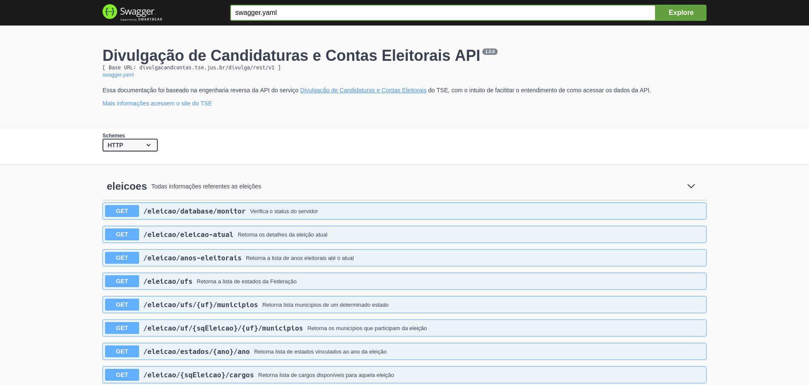

# Documentação da API de Divulgação de Candidaturas do TSE

Esse projeto faz o mapeamento da API do sistema [Divulgação de Candidaturas e Contas Eleitorais](http://divulgacandcontas.tse.jus.br/divulga/#/) para acesso aos dados públicos do TSE para coleta de dados, entre outros. Nele possui dados complementares que no [repositório de dados do TSE](www.tse.jus.br/eleicoes/estatisticas/repositorio-de-dados-eleitorais-1/repositorio-de-dados-eleitorais) como imagem do candidato, entre outros.

Essa documentação é feita usando o [Swagger](https://swagger.io) na versão 3.20.6 por meio do [Swagger Editor](https://editor.swagger.io).

## Como contribuir

O front-end do [sistema](http://divulgacandcontas.tse.jus.br/divulga/#/) é feito com Angular 1.x, dessa forma, pode usar o DevTools do seu browser para verificar as chamadas a API, ou também investigar o código-fonte do app, para entender como é requisitado e enviado os dados para consulta.

Caso encontrei algum endpoint que não estiver documentado, para contribuir é só fazer o fork desse projeto, editar o arquivo `swagger.yaml` respeitando o formato que o Swagger define, e mandar em um novo Pull Request.
